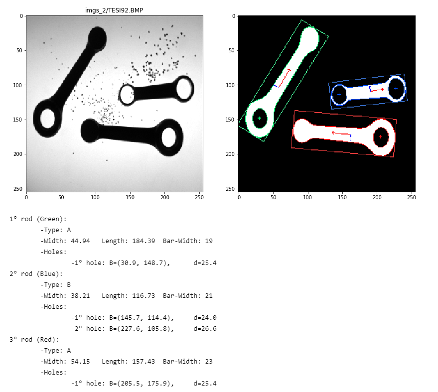

# Stereo Robot Navigation

Project work for the class Computer Vision M, UNIBO. The objective is the development of a software system aimed at visual inspection of motorcycle connecting rods. The system must extract valuable features from the images, and be robust to noise and obstruction.

<p align="center">
  
</p>


## Setup

Install the dependencies using conda:

```shell
conda env create -f environment.yml
```

